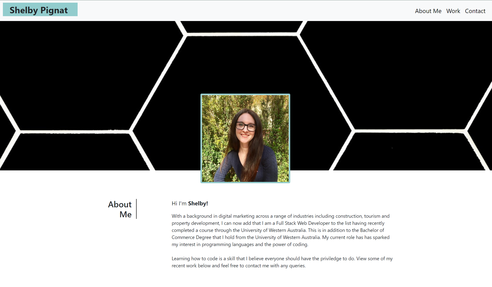

# Portfolio for Shelby Pignat

## This portfolio showcases web applications created by Shelby Pignat, a Full Stack Web Developer.

Any employer is able to view projects that I have worked on or created and successfully view deployed projects. Each of the project examples in this portfolio link to a live application.

# HTML Process

1. Created the HTML structure of the page
2. Used semantic elements in the structure
3. Added indentions for readability
4. CSS selectors added
5. Meta information is included

# CSS Process

Overall the styling applied allows for a reponsive web application to showcase skills and experience. Bootstrap is the CSS framework used.

Header

1. Colour, layout and styling added to the header
2. Headline added identifying the name of the developer
3. Nav bar jumps to relevant information and styling has been applied

Main

1. A hero image that scales is shown with a subtitle as well
2. Section 1 includes an "About Me" heading, information and a profile image
3. Section 2 includes a "Work" heading, 5 image examples of work that link out to the live application, a project name and description
4. Section 3 includes a contact heading and links to my phone number, email, Github, LinkedIn and Resume for potential employers to utilise

## Deployed link

Final link: https://shelbyrp.github.io/portfolio/

## License

@ Shelby R Pignat

Licensed under the [MIT](LICENSE) license.